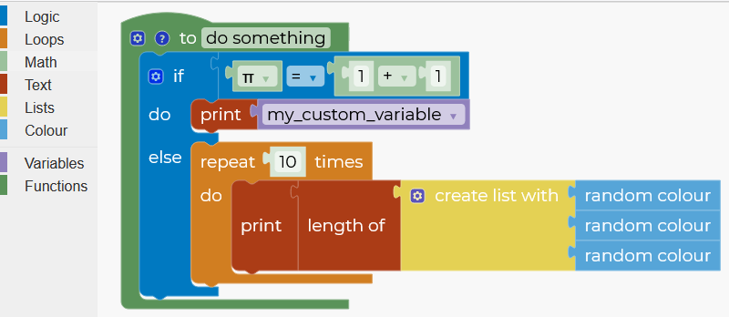

# @aneilmac/blockly-theme-seshat [](https://github.com/google/blockly) 

A  clean, colorful [Blockly](https://www.npmjs.com/package/blockly) theme.



## Installation

### Yarn
```
yarn add @aneilmac/blockly-theme-seshat
```

### npm
```
npm install @aneilmac/blockly-theme-seshat --save
```

## Usage

```js
import * as Blockly from 'blockly';
import {initTheme} from 'blockly-theme-seshat';

const Seshat = initTheme(Blockly);

Blockly.inject('blocklyDiv', {
  theme: Seshat,
});

```

## License
Apache 2.0
